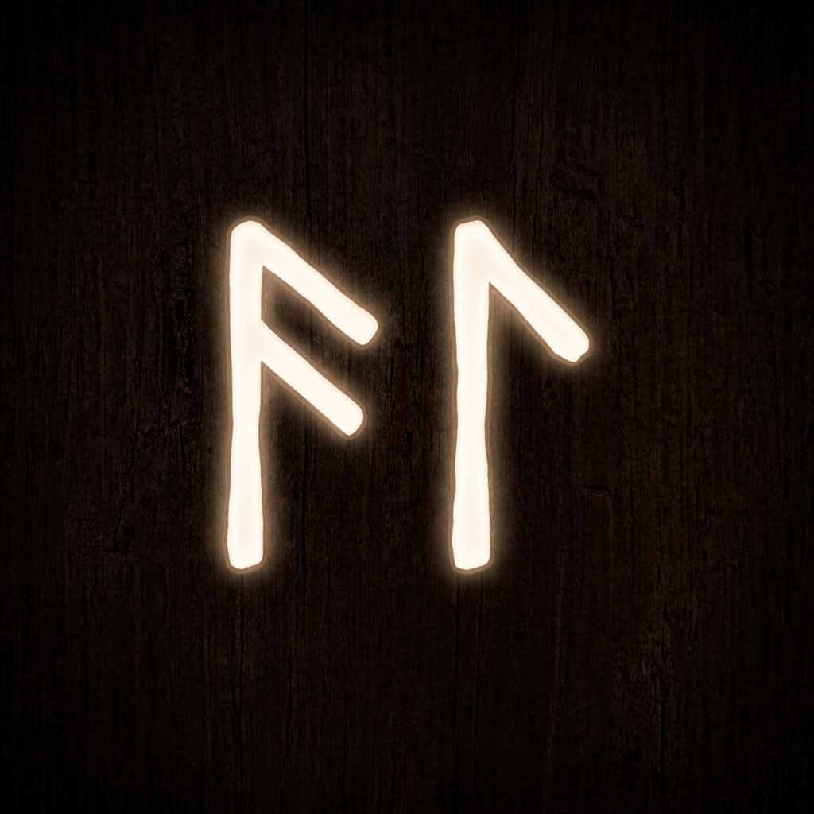
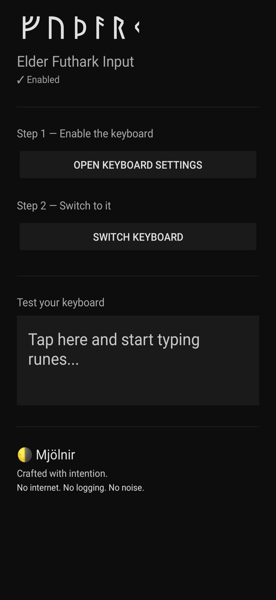
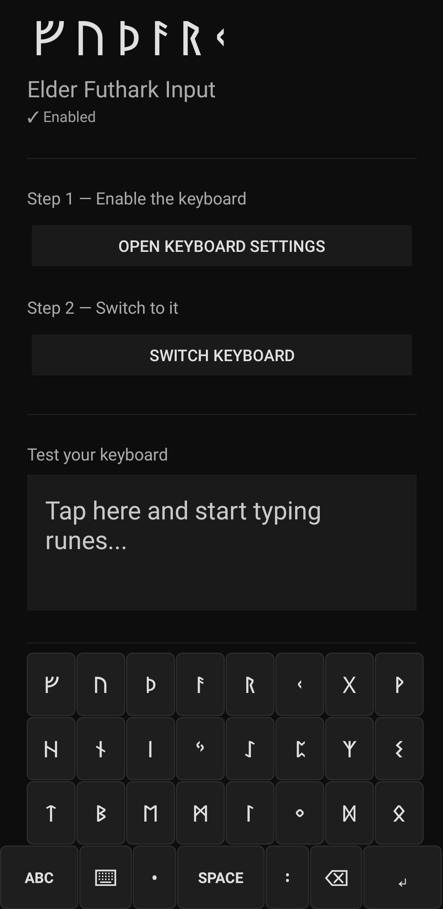
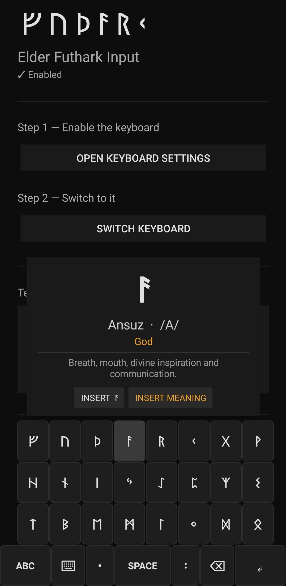
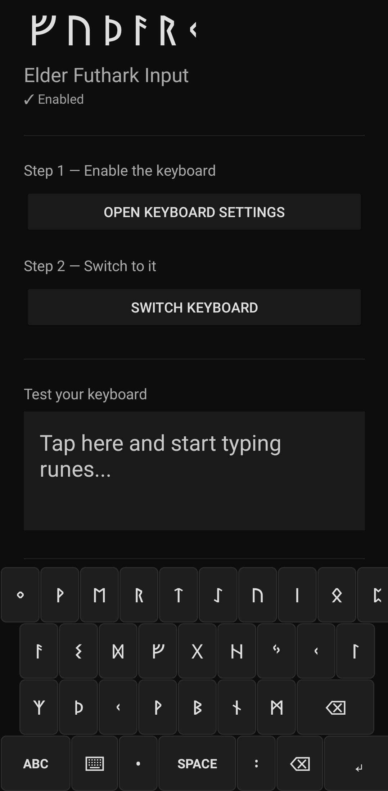
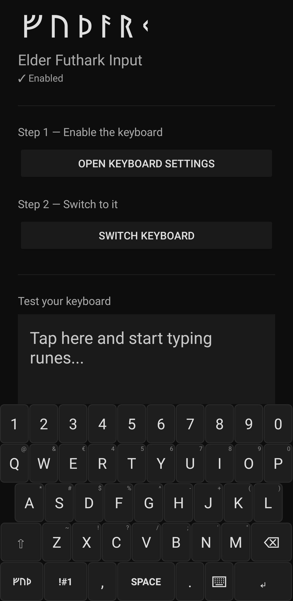

# ᚠᚢᚦᚨᚱᚲ — Futhark Input

> *Before the alphabet, there were the runes.*
> *Before the runes, there was silence.*
> *This keyboard ends the silence.*

<div align="center">

</div>

---

## ⬇ Download

**[→ Download latest APK](../../releases/latest)**

Sideload it. Enable the keyboard. The runes are yours.

> Android only · No Play Store · No tracking · No internet permission

---

## ᚢᚱᚢᛉ — The Origin

Some tools are built for portfolios.
Some are built for deadlines.

This one was built because the runes demanded a worthy vessel —
and every existing option was an insult to the Elder Futhark.

So it was forged from scratch. No shortcuts. No compromises.

Odin hung from Yggdrasil for nine nights to receive the runes.
This keyboard requires only a sideload permission and thirty seconds.
The sacrifice is considerably lighter.

---

## ᚷᛖᛒᛟ — What It Gives You

A system-level Android keyboard — the real kind.
Not a novelty app with a runic skin slapped over Latin input,
but a true IME that replaces your keyboard at the OS level.
Type runes in WhatsApp. In your browser. In your notes.
Anywhere a keyboard opens, this one opens instead.

---

## ᛈ — In the flesh

<div align="center">

<table>
<tr>
<td align="center">
<br/>
<sub>Home screen</sub>
</td>
<td align="center">
<br/>
<sub>Rune Aett keyboard</sub>
</td>
<td align="center">
<br/>
<sub>Long-press rune info</sub>
</td>
</tr>
<tr>
<td align="center">
<br/>
<sub>Rune QWERTY keyboard</sub>
</td>
<td align="center">
<br/>
<sub>English keyboard</sub>
</td>
<td align="center"></td>
</tr>
</table>

</div>

---

## ᚦᚱᛖᛖ — Three modes. One key to cycle them.

| Mode | Layout | Purpose |
|------|--------|---------|
| **ᚠ Rune Aett** | 24 runes across three Aettir | Pure runic input, organized as the ancients organized them |
| **ᛜ Rune QWERTY** | Runes mapped by phonetic position | For those whose fingers know QWERTY but whose hearts know the Futhark |
| **A English** | Full QWERTY + numbers + symbols | Because the modern world still speaks in Latin letters |

One tap cycles through all three. No settings. No menus. No friction.

---

## ᛇ — Long-press: the deep knowledge

Hold any rune. The veil lifts.

A popup surfaces the rune's full identity —
name, phonetic value, meaning, description.
Two choices:

- **INSERT ᚠ** — commit the rune alone, clean and singular
- **INSERT MEANING** — commit the full formatted entry, name and all

---

## ᛈ — What else lives here

- Runic punctuation — ᛫ and ᛬ as dedicated keys, because a comma is a Roman invention
- Shift and caps lock — single tap shifts, double tap locks, triple tap releases
- Long-press symbols on every letter key, corner-hinted so you know what waits beneath
- Full symbols page behind `!#1`
- System keyboard switcher — one key returns you to whatever came before

---

## ᚾᚨᚢᛞᛁᛉ — What It Does Not Do
android.permission.INTERNET    ✗  not requested
Keystroke logging               ✗  not present
Analytics or telemetry          ✗  not present
Cloud sync                      ✗  not present
Ads                             ✗  not present
Regrets                         ✗  not present

The manifest is short enough to read in thirty seconds.
You are encouraged to read it.

---

## ᚱᚨᛁᛞᚺᛟ — Architecture
```
app/src/main/
├── kotlin/com/erebus/futharkinput/
│   ├── FutharkInputService.kt     — The IME. The beating heart.
│   ├── MainActivity.kt            — Setup guide + live test field
│   └── HintKeyboardView.kt        — Custom KeyboardView, draws corner symbol hints
└── res/
├── xml/
│   ├── rune_keyboard.xml          — Aett layout, three rows of eight
│   ├── rune_qwerty_keyboard.xml   — Phonetic QWERTY runic layout
│   ├── qwerty_keyboard.xml        — English layout
│   ├── symbols_keyboard.xml       — Full symbols page
│   └── method.xml                 — IME declaration
├── layout/
│   ├── keyboard_view.xml          — HintKeyboardView host
│   └── activity_main.xml          — Setup screen
└── drawable/
└── key_background.xml         — Key press states
```

**Stack:** Kotlin · Android SDK 24+ · Native `InputMethodService` · Native `KeyboardView`

A note on Jetpack Compose — it was attempted.
It failed, as it always fails inside `InputMethodService`,
because Compose requires a `ViewTreeLifecycleOwner`
that the IME window does not provide.
The native path was the correct path. It always was.

---

## ᛏᛁᚹᚨᛉ — The Rune Map

| Rune | Name | Phonetic | Meaning |
|------|------|----------|---------|
| ᚠ | Fehu | F | Wealth |
| ᚢ | Uruz | U | Strength |
| ᚦ | Thurisaz | TH | Thorn |
| ᚨ | Ansuz | A | God |
| ᚱ | Raidho | R | Journey |
| ᚲ | Kenaz | K | Torch |
| ᚷ | Gebo | G | Gift |
| ᚹ | Wunjo | W | Joy |
| ᚺ | Hagalaz | H | Hail |
| ᚾ | Naudiz | N | Need |
| ᛁ | Isa | I | Ice |
| ᛃ | Jera | J | Year |
| ᛇ | Eihwaz | EI | Yew |
| ᛈ | Perthro | P | Fate |
| ᛉ | Algiz | Z | Protection |
| ᛊ | Sowilo | S | Sun |
| ᛏ | Tiwaz | T | Victory |
| ᛒ | Berkanan | B | Birch |
| ᛖ | Ehwaz | E | Horse |
| ᛗ | Mannaz | M | Man |
| ᛚ | Laguz | L | Water |
| ᛜ | Ingwaz | NG | Fertility |
| ᛞ | Dagaz | D | Dawn |
| ᛟ | Othalan | O | Heritage |

---

## ᛟᚦᚨᛚᚨᚾ — Installation from source

```bash
git clone https://github.com/MJOLNIR14/FutharkInput.git
```

Open in Android Studio · Hedgehog or newer  
Connect device · USB debugging enabled  
Run → Run 'app'

**Minimum SDK:** API 24 — Android 7.0 Nougat  
**Tested on:** Redmi Note 8 · MIUI

### Awakening the keyboard

1. Open the app
2. **Open Keyboard Settings** — enable Futhark Input
3. **Switch Keyboard** — select it
4. Open any text field
5. The runes are there

---

## ᛒᛖᚱᚲᚨᚾᚨᚾ — License

MIT.

Take it. Fork it. Build on it. Ship it.
Carve your name into what you make from it.
That is what the runes have always asked of those who carry them.

---

## ᛊᛟᚹᛁᛚᛟ — Author

**MJOLNIR14**  
[github.com/MJOLNIR14](https://github.com/MJOLNIR14)  
*Building things that should exist but don't.*

---

<div align="center">

*ᚠᛖᚺᚢ᛫ᚢᚱᚢᛉ᛫ᚦᚢᚱᛁᛊᚨᛉ᛫ᚨᚾᛊᚢᛉ᛫ᚱᚨᛁᛞᚺᛟ᛫ᚲᛖᚾᚨᛉ᛫ᚷᛖᛒᛟ᛫ᚹᚢᚾᛃᛟ*  
*ᚺᚨᚷᚨᛚᚨᛉ᛫ᚾᚨᚢᛞᛁᛉ᛫ᛁᛊᚨ᛫ᛃᛖᚱᚨ᛫ᛇᛁᚹᚨᛉ᛫ᛈᛖᚱᚦᚱᛟ᛫ᚨᛚᚷᛁᛉ᛫ᛊᛟᚹᛁᛚᛟ*  
*ᛏᛁᚹᚨᛉ᛫ᛒᛖᚱᚲᚨᚾᚨᚾ᛫ᛖᚺᚹᚨᛉ᛫ᛗᚨᚾᚾᚨᛉ᛫ᛚᚨᚷᚢᛉ᛫ᛜᚷᚹᚨᛉ᛫ᛞᚨᚷᚨᛉ᛫ᛟᚦᚨᛚᚨᚾ*

*The 24 runes. Written as they were always meant to be written.*

</div>
